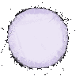

# triangularized_sprites_archived

(2017)
There was an assignment at university to create a filter that approximated images by using various geometric primitives.
I thought this might be a great way to achieve interesting effects when used on simply uninteresting sprites.

Example: 

Original:

Converted:
